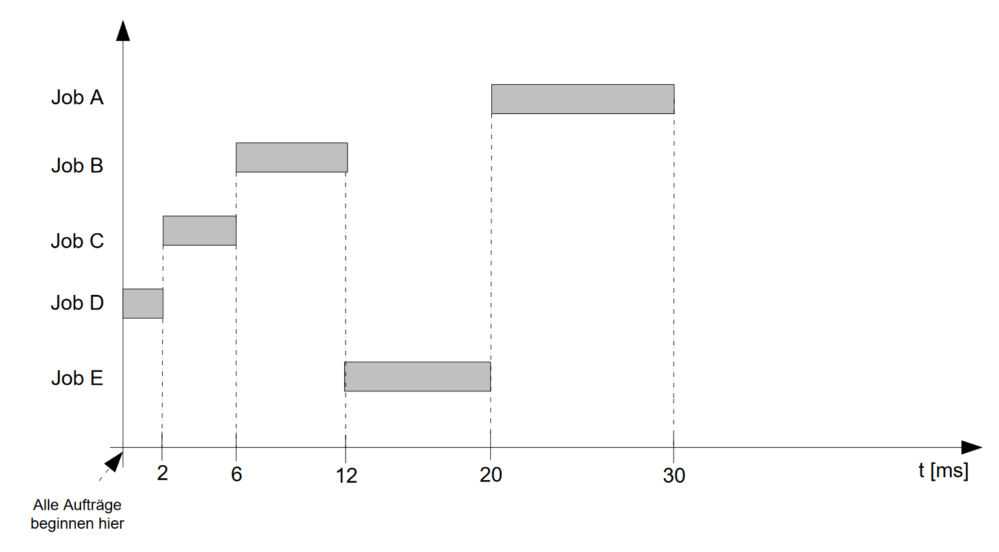

_Übungsaufgabe zur Veranstaltung [IT Systeme](https://hsro-wif-it.github.io) im [Bachelorstudiengang Wirtschaftsinformatik](https://www.th-rosenheim.de/technik/informatik-mathematik/wirtschaftsinformatik-bachelor/) an der [Hochschule Rosenheim](http://www.th-rosenheim.de)._


# 04 - Betriebssysteme

In dieser Übung werden wir uns weiter ein wenig mit Schaltnetzwerken beschäftigen.

**Die Lösung befindet sich im Branch Musterloesung.**


## Aufgabe 1: Prozesse

Gegeben ist folgendes Java Programm. Es ruft einen Prozess aus einem Java Programm auf. Dabei wird das Resultat auf `System.out` ausgeben.

```java
import java.io.*;
import java.util.concurrent.Executors;
import java.util.concurrent.TimeUnit;
import java.util.function.Consumer;

public class Proc {

    private static class StreamGobbler implements Runnable {
        private InputStream inputStream;
        private Consumer<String> consumer;

        public StreamGobbler(InputStream inputStream, Consumer<String> consumer) {
            this.inputStream = inputStream;
            this.consumer = consumer;
        }

        @Override
        public void run() {
            new BufferedReader(new InputStreamReader(inputStream)).lines().forEach(consumer);
        }
    }

    public static void main(String[] args)  {
        // bestimmt, um welches OS es sich handelt
        boolean isWindows = System.getProperty("os.name")
                .toLowerCase().startsWith("windows");

        ProcessBuilder builder = new ProcessBuilder();
        if (isWindows) {
            builder.command("cmd.exe", "/c", "dir");
        } else {
            builder.command("sh", "-c", "ls");
        }
        // Setzen spezifischer Einstellungen
        builder.directory(new File(System.getProperty("user.home")));

        try {
            Process process = builder.start();
            StreamGobbler streamGobbler = new StreamGobbler(process.getInputStream(), System.out::println);
            Executors.newSingleThreadExecutor().submit(streamGobbler);
            process.waitFor(1000, TimeUnit.MILLISECONDS);
        }
        catch (IOException ex) {
            System.out.println(ex.getMessage());
        }
        catch (InterruptedException iex) {
            System.out.println(iex.getMessage());
        }

    }
}
```
## a)
Legen Sie zunächst ein Projekt an, compilieren das Projekt und führen das Program aus.

- Welche Ausgabe bekommen Sie?
- Welches Systemprogramm wird ausgeführt und was bedeuten die Parameter?

## b)
Können Sie das Verzeichnis ändern, das ausgeben wird?

## c)
Ändern Sie das Programm so ab, dass Sie ein  beliebiges Command über die Commandline beim Programmaufruf als Argument übergeben können, z.b.

Beispiele (auf Windows):

 ```cmd
 // Verzeichnis 'test' anlegen
java Proc "mkdir test"  

// das kennen Sie schon
java Proc "dir"

// löscht da Verzeichnis 'test' wieder
java Proc "rmdir test"

// das kennen Sie schon
java Proc "dir"
```

## d)

Ändern Sie die Ausgabe so ab, dass stets die Systemzeit der Zeile vorgestellt wird, z.B.:

```
1572294004867: 03/15/2019  08:40 AM    <DIR>          Saved Games
1572294004868: 05/14/2019  11:05 AM    <DIR>          Searches
1572294004868: 05/20/2019  10:38 AM    <DIR>          source
1572294004868: 10/16/2019  07:02 PM             2,695 test.pf
1572294004868: 10/02/2019  12:08 PM             1,069 text.txt
```

> Note: Hierzu können Sie die komplette `run()`-Methode umschreiben oder einfach eine `map`-Methode in den Stream einfügen, mit einem entsprechenden Lambda-Ausdruck.

**Loesung**:

```java
import java.io.*;
import java.util.concurrent.Executors;
import java.util.concurrent.TimeUnit;
import java.util.function.Consumer;

public class Proc {

    private static class StreamGobbler implements Runnable {
        private InputStream inputStream;
        private Consumer<String> consumer;

        public StreamGobbler(InputStream inputStream, Consumer<String> consumer) {
            this.inputStream = inputStream;
            this.consumer = consumer;
        }

        @Override
        public void run() {
            new BufferedReader(new InputStreamReader(inputStream)).
                    lines().
                    map(s -> System.currentTimeMillis() + ": " + s).
                    forEach(consumer);
        }
    }

    public static void main(String[] args)  {
        // bestimmt, um welches OS es sich handelt
        boolean isWindows = System.getProperty("os.name")
                .toLowerCase().startsWith("windows");

        ProcessBuilder builder = new ProcessBuilder();
        if (isWindows) {
            builder.command("cmd.exe", "/c", args[0]);
        } else {
            builder.command("sh", "-c", args[0]);
        }
        // Setzen spezifischer Einstellungen
        builder.directory(new File(System.getProperty("user.home")));

        try {
            Process process = builder.start();
            StreamGobbler streamGobbler = new StreamGobbler(process.getInputStream(), System.out::println);
            Executors.newSingleThreadExecutor().submit(streamGobbler);
            process.waitFor(1000, TimeUnit.MILLISECONDS);
        }
        catch (IOException ex) {
            System.out.println(ex.getMessage());
        }
        catch (InterruptedException iex) {
            System.out.println(iex.getMessage());
        }

    }
}
```

## e)   

Ändern Sie die Ausgabe so um, dass diese in eine Datei 'dat.txt' geschrieben wird und diese kontinuierlich weitergeschrieben wird.

## Aufgabe 2: Scheduling

Folgende hypothetische Aufgabe:
- 5 Aufträge A–E treffen im System fast gleichzeitig ein
- Geschätzte Ausführungszeiten in Millisekunden: A=10, B=6, C=4, 
D=2, E=8
- Prioritäten: A=3, B=5, C=2, D=1, E=4 (5 ist höchste)
- Der Rechner verfügt über eine CPU (einen Rechnerkern)
- Gesucht: Durchschnittliche Verweilzeit im System  (Gesamtzeit/Anzahl Aufträge)

Es gilt also:
| Job  | A  | B | C | D | E |
|------|----|---|---|---|---| 
| Zeit | 10 | 6 | 4 | 2 | 8 |
| Prio |  3 | 5 | 2 | 1 | 4 |

### a)

Berechnen Sie für

1. Priority Scheduling (nicht verdrängend)

**Loesung:**

Es gilt also:
| Job  | B  | E | A  | C | D |
|------|----|---|----|---|---| 
| Zeit im System | 6  | 14| 24 | 28 | 30 |

Summe: 102

Mittlere Verweilzeit = 102 / 5 = 20.4 ms


1. FCFS (Reihenfolge Annahme: A, B, D, C, E) (nicht verdrängend)

**Loesung:**

Es gilt also:
| Job  | A  | B | C  | D | E |
|------|----|---|----|---|---| 
| Zeit im System | 10  | 16| 20 | 22 | 30 |

Summe: 96

Mittlere Verweilzeit = 96 / 5 = 19.2 ms


1. Shortest Job First (nicht verdrängend)

**Loesung:**

Es gilt also:
| Job  | D  | C | B  | E | A |
|------|----|---|----|---|---| 
| Zeit im System | 2  | 6| 12 | 20 | 30 |

Summe: 70

Mittlere Verweilzeit = 70 / 5 = 14.0 ms



**Prozesswechselzeit wird vernachlässigt!** 

**Aufträge werden nacheinander ausgeführt!**

### b)

Gegeben ist folgendes UML Diagramm:


1. Implementieren Sie die Klassen `Process` und `Schedulder`. Ein Scheduler kann n Prozesse verwalten. Wählen Sie eine entsprechende Datenstruktur im Scheduler.
2. Fügen Sie einen Testcase hinzu, der dem Scheduler die Prozesse (A-E) aus Teil a hinzufügt.
3. Die Methoden `calculatePrioScheduling`, `calculateFCFS` und `calcualteSJF` sollen die durchschnittliche Verweilzeit im System berechnen. Idealerweise bestätigen Sie die Ergebnisse in Teil a!
    - Ist es möglich eine private Methode zur Berechnung zu erstellen, die bei geeigneter Vorsortierung für alle 3 Fälle die Berechnung durchführt?

```java
import java.util.ArrayList;
import java.util.Arrays;
import java.util.Comparator;
import java.util.List;

public class Scheduler {

    static class Process {

        private String id;
        private int prio;
        private int duration;

        Process(String Id, int Prio, int Duration) {
            this.id       = Id;
            this.prio     = Prio;
            this.duration = Duration;
        }

    }

    private ArrayList<Process> processes;

    Scheduler() {
        this.processes = new ArrayList<Process>();
    }

    public void addProcess(Process p) {
        this.processes.add(p);
    }

    public double calculatePrioScheduling() {
        List<Process> l = new ArrayList<>(this.processes);
        l.sort((a,b) -> Integer.compare(b.prio, a.prio));
        return calculateAvgTime(l);
    }

    public double calculateFCFS() {
        List<Process> l = new ArrayList<>(this.processes);
        return calculateAvgTime(l);
    }

    public double calculateSJF() {
        List<Process> l = new ArrayList<>(this.processes);
        l.sort(Comparator.comparingInt(a -> a.duration));
        return calculateAvgTime(l);
    }

    private double calculateAvgTime(List<Process> l) {
        double result = 0;
        int[] time = new int[l.size()];
        int index = 0;
        int prev = 0;
        for (Process p: l) {
            time[index++] = p.duration + prev;
            prev = time[index-1];
        }
        return Arrays.stream(time).sum()/l.size();
    }

    public static void main(String[] args) {
        Scheduler s = new Scheduler();
        s.addProcess(new Process("A", 3, 10));
        s.addProcess(new Process("B", 5, 6));
        s.addProcess(new Process("C", 2, 4));
        s.addProcess(new Process("D", 1, 2));
        s.addProcess(new Process("E", 4, 8));

        System.out.println(s.calculatePrioScheduling());
        System.out.println(s.calculateFCFS());
        System.out.println(s.calculateSJF());
    }
}
```